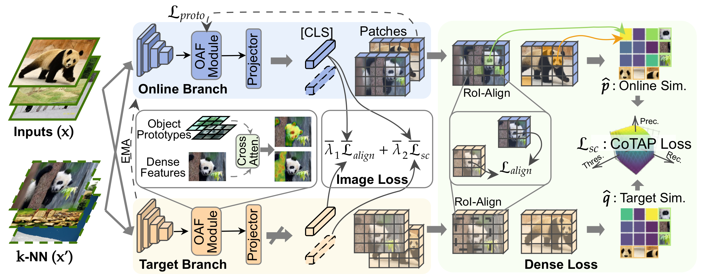

# CoTAP

This is the official code for the paper "Semantic Concentration for Self-Supervised Dense Representations Learning" accepted by IEEE Transactions on Pattern Analysis and Machine Intelligence (TPAMI 2025). 
<!-- This paper is available at [**here**](https://arxiv.org/abs/2503.15096). -->

[](https://arxiv.org/abs/2509.09429)

**Semantic Concentration for Self-Supervised Dense Representations Learning**

**Authors: [Peisong Wen](https://kid-7391.github.io/),  [Qianqian Xu*](https://qianqianxu010.github.io/), [Siran Dai](https://scholar.google.com.hk/citations?user=_6gw9FQAAAAJ&hl=zh-CN&oi=ao), [Runmin Cong](https://rmcong.github.io/), [Qingming Huang*](https://people.ucas.ac.cn/~qmhuang)**   




## 🚩 Checkpoints

| Method | Backbone | Linear Seg (mIoU) | kNN Cls (Acc) | Linear Cls (Acc) | Download |
| ------ | -------- | ----------------- | ------------- | ---------------- | -------- |
| DINO+CoTAP    | VIT-S/16 | 50.5 | 78.0 | 79.1 | [link](https://huggingface.co/KID-7391/CoTAP/blob/main/checkpoints/ours/vits16/dino%2Bcotap.ckpt) |
| Leopart+CoTAP | VIT-S/16 | 50.4 | 77.3 | 78.6 | [link](https://huggingface.co/KID-7391/CoTAP/blob/main/checkpoints/ours/vits16/leopart%2Bcotap.ckpt) |
| iBOT+CoTAP    | VIT-S/16 | 51.6 | 78.4 | 79.4 | [link](https://huggingface.co/KID-7391/CoTAP/blob/main/checkpoints/ours/vits16/ibot%2Bcotap.ckpt) |
| Mugs+CoTAP    | VIT-S/16 | 51.6 | 78.9 | 79.4 | [link](https://huggingface.co/KID-7391/CoTAP/blob/main/checkpoints/ours/vits16/mugs%2Bcotap.ckpt) |
| DINO+CoTAP    | VIT-B/16 | 52.2 | 79.2 | 80.2 | [link](https://huggingface.co/KID-7391/CoTAP/blob/main/checkpoints/ours/vitb16/dino%2Bcotap.ckpt) |
| iBOT+CoTAP    | VIT-B/16 | 53.9 | 80.1 | 80.8 | [link](https://huggingface.co/KID-7391/CoTAP/blob/main/checkpoints/ours/vitb16/ibot%2Bcotap.ckpt) |
| Mugs+CoTAP    | VIT-B/16 | 52.1 | 80.8 | 81.7 | [link](https://huggingface.co/KID-7391/CoTAP/blob/main/checkpoints/ours/vitb16/mugs%2Bcotap.ckpt) |
| DINO+CoTAP    | VIT-B/8  | 54.7 | 81.6 | 82.1 | [link](https://huggingface.co/KID-7391/CoTAP/blob/main/checkpoints/ours/vitb8/dino%2Bcotap.ckpt) |


## 💻 Environments

* **Ubuntu** 20.04
* **CUDA** 11.6
* **Python** 3.9.13
* **Pytorch** 1.13.1

See `requirement.txt` for others.

## 🔧 Installation

1. Clone this repository

    ```bash
    git clone https://github.com/KID-7391/cotap.git
    ```

2. Create a virtual environment with Python 3.9 and install the dependencies

    ```bash
    conda create --name CoTAP python=3.9
    conda activate CoTAP
    ```

3. Install the required libraries

    ```bash
    pip install -r requirements.txt
    ```

## 🚀 Training

### Dataset

1. Download [ImageNet-1k](https://www.image-net.org/download.php), [COCO](https://cocodataset.org/#home), and [COCOStuff164k](https://www.robots.ox.ac.uk/~xuji/datasets/COCOStuff164kCurated.tar.gz).
2. Download [NNS](https://huggingface.co/KID-7391/CoTAP/blob/main/nns.zip) (indices of the nearest neighbors).
3. Place them in `data` with the following structure:
    ```
    CoTAP
    └── data
        ├── imagenet-1k
        |   ├── train
        |   |   ├── n01440764
        |   |   │   │── n01440764_18.JPEG
        |   |   │   └── ...
        |   └── val
        |       └── n01440764
        |           ├── ILSVRC2012_val_00000293.JPEG
        |           └── ...
        ├── coco
        |   ├── images
        |   |   ├── train2017
        |   |   │   ├── 000000000009.jpg
        |   |   │   └── ...
        |   |   └── val2017
        |   |       ├── 000000000139.jpg
        |   |       └── ...
        |   ├── annotations
        |   |   ├── train2017
        |   |   │   ├── 000000000009.png
        |   |   │   └── ...
        |   |   └── val2017
        |   |       ├── 000000000139.png
        |   |       └── ...
        |   └── curated
        └── nns
            ├── nns_vit_base_imagenet1k_train_None_224.npz
            └── ...
    ```

### Initialization Checkpoints

Download one of the following checkpoints for initialization. DINO checkpoints will be automatically downloaded.

| Method | Backbone | Linear Seg (mIoU) | kNN Cls (Acc) | Linear Cls (Acc) | Download |
| ------ | -------- | ----------------- | ------------- | ---------------- | -------- |
| DINO    | VIT-S/16 | 38.8 | 74.5 | 77.0 | - |
| Leopart | VIT-S/16 | 47.2 | 55.0 | 70.0 | [link](https://huggingface.co/KID-7391/CoTAP/blob/main/checkpoints/competitor/vits16/leopart.ckpt) |
| iBOT    | VIT-S/16 | 45.8 | 75.2 | 77.9 | [link](https://huggingface.co/KID-7391/CoTAP/blob/main/checkpoints/competitor/vits16/ibot.ckpt) |
| Mugs    | VIT-S/16 | 47.5 | 75.6 | 78.9 | [link](https://huggingface.co/KID-7391/CoTAP/blob/main/checkpoints/competitor/vits16/mugs.ckpt) |
| DINO    | VIT-B/16 | 44.0 | 76.1 | 78.2 | - |
| iBOT    | VIT-B/16 | 49.6 | 77.1 | 79.5 | [link](https://huggingface.co/KID-7391/CoTAP/blob/main/checkpoints/competitor/vitb16/ibot.ckpt) |
| Mugs    | VIT-B/16 | 49.6 | 78.0 | 80.6 | [link](https://huggingface.co/KID-7391/CoTAP/blob/main/checkpoints/competitor/vitb16/mugs.ckpt) |
| DINO    | VIT-B/8  | 45.9 | 77.4 | 80.1 | - |


### Scripts

See `configs` and `scripts` for default hyperparameters. Run the following command for training.

```bash
bash scripts/run_[backbone]_[init_method].sh
```

For examples:
```bash
bash scripts/run_vits16_dino.sh
```

## 📊 Evaluation

1. Download the test datasets and place them into `data`: [COCOStuff27](https://www.robots.ox.ac.uk/~xuji/datasets/COCOStuff164kCurated.tar.gz), [PASCAL-VOC](http://host.robots.ox.ac.uk/pascal/VOC/), [ADE20k](https://github.com/CSAILVision/ADE20K?utm_source=chatgpt.com), and [Cityscapes](https://www.cityscapes-dataset.com/?utm_source=chatgpt.com).
2. Modify `evaluate_group` in `scripts/test_seg.sh` to choose test settings; modify `model` in `scripts/test_seg.sh` and `scripts/test_in1k_knn.sh` to setup model paths.
3. Run the following command for kNN classification and semantic segmentation:
```bash
bash scripts/test_in1k_knn.sh
bash scripts/test_seg.sh
```


## 🖋️ Citation

If you find this repository useful in your research, please cite the following papers:

```
@misc{wen2025semantic,
      title={Semantic Concentration for Self-Supervised Dense Representations Learning},
      author={Peisong Wen and Qianqian Xu and Siran Dai and Runmin Cong and Qingming Huang},
      year={2025},
      eprint={2509.09429},
      archivePrefix={arXiv},
      primaryClass={cs.CV},
      url={https://arxiv.org/abs/2509.09429},
}
```

## 📧 Contact us

If you have any detailed questions or suggestions, you can email us: wenpeisong@ucas.ac.cn. We will reply in 1-2 business days. Thanks for your interest in our work!


## 🌟 Acknowledgements

Our code is based on the official PyTorch implementation of [DINO](https://github.com/facebookresearch/dino), [Leopart](https://github.com/MkuuWaUjinga/leopart), and [STEGO](https://github.com/mhamilton723/STEGO).
