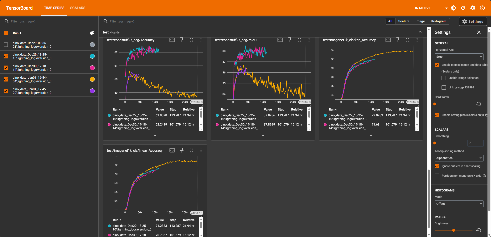

## Sharpness-Aware Contrastive Learning

**问题**: 在物体边缘处的 Patch，包含了一部分前景和一部分背景。普通的对比学习容易在这些区域产生剧烈波动的特征，因为它试图区分前景和背景。

**SAM 的作用**: 通过扰动特征，模型被迫学习一种“折中”或更鲁棒的表示，使得物体边界的特征过渡更加平滑。这对下游任务（如语义分割、实例分割）非常有利，因为这些任务非常依赖边界的一致性。

### 创新点
- **特征空间的 Sharpness**：不只关注参数空间的平坦极小值，而是关注特征空间中表征对扰动的稳定性。若一个 patch 表征是可靠的，它在特征空间的小范围扰动下应保持匹配关系与排序关系稳定。
- **Feature-SAM 机制**：将 SAM 的 min-max 思想从参数扰动迁移到特征扰动。在每步训练中，对学生网络的 patch 特征构造使对比目标最不利的对抗扰动，然后最小化该最不利目标，使特征向语义簇中心收缩并扩大类间间隔。
- **置信度驱动的权重**：利用教师分支的相似度分布熵度量置信度，降低高熵区域对 Feature-SAM 与对比损失的影响。

#### 1.Loss改进
- **目标**：在特征扰动球内最小化最坏情况的对比损失  
  \[
  \min_{\theta}\max_{\|\delta\|\le\rho}\ \mathcal{L}_{contrast}(Z_s+\delta,\ Z_t)
  \]
- **扰动近似**：单步梯度上升近似内层最优化  
  \[
  \delta^\*=\rho\cdot\frac{\nabla_{Z_s}\mathcal{L}_{contrast}}{\|\nabla_{Z_s}\mathcal{L}_{contrast}\|_2}
  \]
- **熵权重**：教师相似度分布 \(p\) 的熵 \(H(p)\) 作为置信度反比  
  \[
  w=\exp(-\gamma H(p))
  \]

#### 2. 训练流程
- **输入**：同一 batch 的学生特征与教师特征，教师特征作为目标不回传梯度
- 计算基础 patch-level 对比或排序损失
- 对学生特征求梯度并生成对抗扰动 \(\delta^\*\)
- 将 \(\delta^\*\) 视为常量加入学生特征，再计算一次最终损失
- 反向传播更新学生网络参数
- 教师网络仍使用 EMA 更新

#### 3. 新加的参数
- **rho**：扰动半径。
- **gamma**：熵权重衰减力度
- **tau**：教师分布温度，影响熵计算稳定性

### 遇到的问题

- **蓝色**：cotap(imagenet+coco)
- **红色**：ours(imagenet+coco)
- **黄色**：cotap(imagenet)
- **紫色**：ours(imagenet)

1. 无法复现cotap原论文的结果
2. 增加我们的方法后没有明显的改进，无论加不加我们的方法，也比不上dino的结果，已在尝试更换baseline
